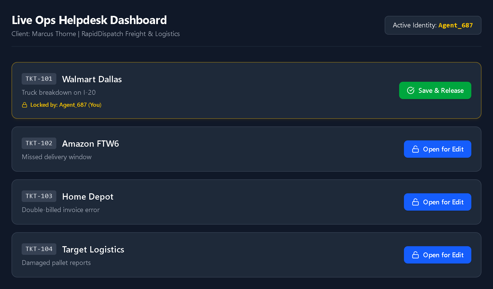

# Live Ops Helpdesk Terminal 🚀

A real-time collaborative support platform built for **RapidDispatch Freight & Logistics** (Dallas, TX, USA). The system eliminates multi-agent ticket collision and completely resolves support ticket race conditions under high-concurrency environments.

The platform implements a bulletproof **Mutex (Mutual Exclusion) Lock** architecture running entirely on an in-memory data store on the server layer to achieve sub-millisecond execution speeds.

## 📸 Preview


## 📺 Project Demo (Week 19)
[]()

---
## ⚡ Key Concurrency Features
1. Atomic In-Memory Locking: Traditional database queries are far too slow ($150\text{ms}-300\text{ms}$ disk I/O latency) for instant state locks. Therefore, all active ticket mutations are monitored and stored inside the Node.js process memory layer (Map()), completing state allocations in sub-milliseconds to eliminate race conditions.

2. Visual Mutex State Isolation: When an agent acquires a lock, the target row instantly turns gray across all other connected screens. The main interaction buttons mutate into a disabled "MUTEX LOCKED" status string, accompanied by an informative padlock overlay showing "Locked by: [Agent_ID]"—all occurring without page refreshes.

3. The Ghost Disconnect Handler: If an agent locks a ticket and abruptly closes their browser tab or loses their internet connection without unlocking, the backend's socket.on('disconnect') loop triggers a memory sweep. It automatically purges the abandoned locks from RAM and broadcasts the asset release message to all connected peers in under 1 second.

4. Connection Loss Banner (Graceful Degradation): The terminal features a continuous network listener. If the socket pipeline drops due to network connectivity loss, a flashing critical warning banner alerts the user: "Connection Lost: Reconnecting...", ensuring data safety awareness.

## 🛠️ Tech Stack & Architecture

* **Frontend Layer:** React.js, Tailwind CSS (Minimalist Bento Dashboard UI Layout), Lucide Icons
* **Real-time Engine:** Socket.io-client (Persistent bidirectional WebSockets connection)
* **Backend Runtime:** Node.js, Express.js, Socket.io (Core Event Engine Server)
* **In-Memory Storage:** Native JavaScript `Map()` structure (Bypasses slow Database I/O bottlenecks)

---
# 🚀 Local Installation & Setup Guide
1. Backend Engine Installation
Open a terminal window, navigate to the backend directory, install the core dependencies, and spin up the development daemon:

cd rapid-dispatch-backend
npm install

# Create a local .env inside the rapid-dispatch-backend folder:
PORT=5000
FRONTEND_URL=http://localhost:5173

# Run development server
npm run dev

2. Frontend Application Installation
Open a secondary terminal window, navigate to the frontend folder, and execute the Vite development pipeline:

cd rapid-dispatch-frontend
npm install

# Create a local .env inside the rapid-dispatch-frontend folder:
VITE_BACKEND_URL=http://localhost:5000

# Start the dashboard UI
npm run dev

# 🌐 Production Guardrails (CORS & WSS Security)
1. WSS Secure Handshake: When hosted live on production, the client platform enforces https:// secure protocols. The socket.io-client driver automatically intercepts this environment state and up-shifts standard network handshakes into WSS:// (WebSocket Secure).

2. Cross-Origin Framework: Both the Express web application layer and the Socket network engine enforce synchronous CORS routing arrays mapped explicitly to the live Vercel tracking parameters to satisfy rigorous cross-domain security reviews.

## 📁 Project Directory Structure

```text
rapid-dispatch-system/
├── rapid-dispatch-backend/       # Track B: Core Server Engine
│   ├── src/
│   │   ├── config/
│   │   │   └── socket.js          # Socket.io initialization & CORS setup
│   │   ├── controllers/
│   │   │   └── ticketController.js # REST initial state data allocation
│   │   ├── sockets/
│   │   │   ├── lockStore.js       # RAM Memory Map (Source of truth)
│   │   │   └── ticketHandler.js   # Event listeners (lock/unlock/join)
│   │   ├── routes/
│   │   │   └── ticketRoutes.js    # Express REST endpoints
│   │   ├── app.js                 # HTTP Application Middleware configuration
│   │   └── server.js              # Server bootstrapper
│   └── .env
└── rapid-dispatch-frontend/      # Track A: Client Interface UI
    ├── src/
    │   ├── socket.js              # Global Client-Socket instance registry
    │   ├── App.jsx                # Concurrency UI Component with cleanup maps
    │   └── main.jsx
    └── .env